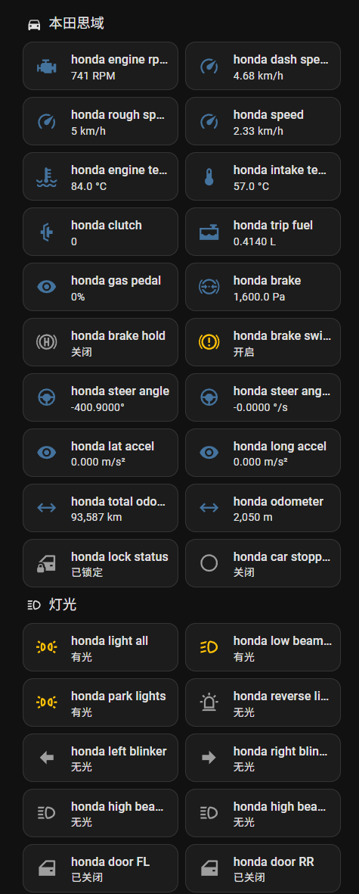

# ESPHome Honda — 本田汽车 OBD CAN 数据采集



基于 **ESP32-S3** 的车辆 OBD 数据采集器，通过 **CAN 总线**读取本田汽车实时数据，通过 **MQTT** 上报到 **Home Assistant**，并可选通过 **BLE** 发送到 **RaceChrono** 用于赛道记录。

## 功能概述

- 读取本田（Honda）车辆 **CAN 总线 OBD-II** 数据，500Kbps
- 通过 **MQTT over TLS** 将传感器数据发布到 Home Assistant
- 原生 ESPHome 配置，与 HA 无缝集成（MQTT Discovery）
- 通过 **BLE (ESP32 BLE Server)** 转发 CAN 原始帧到 RaceChrono 用于赛道记录
- 支持多 WiFi 网络自动切换
- 板载 RGB LED 指示灯显示设备状态

## 硬件需求

| 组件 | 说明 |
|------|------|
| **ESP32-S3 开发板** | 我使用的 N16R8（16MB Flash + 8MB PSRAM Octal），理论上任何基于ESP32-S3的开发板都可以 |
| **CAN 收发器** | SIT1051 |
| **OBD-II 线束** | 兼容本田 OBD 接头（CAN-H / CAN-L） |


### 引脚分配

| GPIO | 功能 |
|------|------|
| GPIO1 | CAN TX |
| GPIO2 | CAN RX |
| GPIO21 | LED 红色（输出，低电平有效）可有可无 |
| GPIO47 | LED 绿色（开关，低电平有效）可有可无 |
| GPIO48 | LED 蓝色（开关，低电平有效）可有可无 |
| GPIO0 | BOOT 按键（物理按键，含上拉）可有可无 |

### 接线

```
ESP32-S3                  SIT1051
GPIO1  ────────────────→  TXD
GPIO2  ────────────────→  RXD
3.3V   ────────────────→  VCC
GND    ────────────────────  GND

SIT1051                   OBD-II (DLC 接口)
CANH   ────────────────→  PIN 6 (CAN High)
CANL   ────────────────→  PIN 14 (CAN Low)
GND    ────────────────→  PIN 4 (Chassis Ground)
```

> ⚠️ CAN收发器和ESP32S3之间建议加电平转换器，或使用3.3V的CAN收发器。

## 快速开始

### 1. 克隆项目

```bash
git clone https://github.com/pokebox/esphome_honda_civic esphome_honda_civic
cd esphome_honda_civic
```

### 2. 配置 secrets

创建 `secrets.yaml`（与 `esphome_honda.yaml` 同一目录）：

```yaml
# WiFi
wifi_ssid: "你的主WiFi名称"
wifi_password: "你的主WiFi密码"
wifi_home_iot: "家庭IoT网络"
wifi_home_pwd: "IoT密码"
wifi_1_ssid: "备用网络1"
wifi_1_pwd: "备用密码1"
wifi_2_ssid: "备用网络2"
wifi_2_pwd: "备用密码2"
wifi_3_ssid: "备用网络3"
wifi_3_pwd: "备用密码3"

# MQTT
mqtt_server: "mqtt.your-domain.com"
mqtt_server_user: "mqtt用户名"
mqtt_server_pwd: "mqtt密码"
ca_file: |
  -----BEGIN CERTIFICATE-----
  ...你的 CA 证书内容...
  -----END CERTIFICATE-----
```

> MQTT 使用 **8883 端口（TLS）** 加密连接，需要提供 CA 证书文件。

### 3. 编译 & 上传

```bash
# 在 ESPHome 环境中编译
esphome compile esphome_honda.yaml

# 首次/无线上传（设备需先通过 USB 连接）
esphome upload esphome_honda.yaml

# 后续 OTA 更新
esphome run esphome_honda.yaml
```

### 4. 首次连接

设备启动后会自动连接 WiFi，连接成功后**绿色 LED** 常亮。随后连接 MQTT 服务器，Home Assistant 会通过 MQTT Discovery 自动发现所有传感器实体。

如果没有WiFi，则HA不可用，但蓝牙功能依然可以保留给 RaceChrono获取数据。

## LED 指示灯说明

| LED | 状态 | 含义 |
|-----|------|------|
| 🟢 **绿色** | 常亮 | WiFi + MQTT 均已连接 |
| 🟢 **绿色** | 熄灭 | WiFi 或 MQTT 断开中 |
| 🔵 **蓝色** | 切换控制 | 可通过 BOOT 按键或 HA 开关切换 |
| 🔴 **红色** | — | 当前未使用（我的板子物理连接了电源指示灯） |


## 传感器列表

### 数值传感器 (Sensor)

| 实体名称 | 单位 | CAN ID | 说明 |
|----------|------|--------|------|
| `engine rpm` | RPM | 0x17C | 发动机转速 |
| `speed` | km/h | 0x158 | CAN 总线车速 |
| `dash speed` | km/h | 0x309 | 仪表盘显示车速 |
| `rough speed` | km/h | 0x309 | 粗略速度（整数） |
| `gas pedal` | % | 0x17C | 油门踏板开度 |
| `brake` | kPa | 0x1A4 | 制动主缸压力 |
| `steer angle` | ° | 0x14A | 方向盘转角（负值=左转） |
| `steer angle rate` | °/s | 0x14A | 方向盘角速度 |
| `lat accel` | m/s² | 0x1EA | 横向加速度 |
| `long accel` | m/s² | 0x1EA | 纵向加速度 |
| `engine temp` | °C | 0x324 | 发动机冷却液温度 |
| `intake temp` | °C | 0x324 | 进气温度 |
| `MAP kPa` | kPa | 0x34E | 进气歧管绝对压力 |
| `odometer` | m | 0x158 | 单次行程里程 |
| `total odometer` | km | 0x516 | 总行驶里程 |
| `trip fuel` | L | 0x324 | 行程燃油消耗量 |
| `wiper switch` | — | 0x374 | 雨刮器控制档位 |
| `wipers` | — | 0x37B | 雨刮运行状态 |
| `clutch` | — | 0x465 | 可能是离合器状态，待定 |

### 开关量传感器 (Binary Sensor)

| 实体名称 | 说明 |
|----------|------|
| `light all` | 所有外部灯光（通用信号） |
| `low beams light` | 近光灯 |
| `high beams light` | 远光灯 |
| `high beam hold` | 远光闪烁（闪灯） |
| `park lights` | 示廓灯 / 驻车灯 |
| `left blinker` | 左转向灯 |
| `right blinker` | 右转向灯 |
| `reverse light` | 倒车灯 |
| `brake switch` | 刹车开关（踏板踩下） |
| `parking brake` | 手刹拉起 |
| `EPB active` | 电子手刹激活 |
| `ESP disabled` | ESP/VSA 关闭 |
| `brake hold` | Brake Hold（自动驻车）激活 |
| `ECON on` | ECON 节能模式开启 |
| `car stopped` | 车辆停稳信号 |
| `lock status` | 车门锁定状态 |
| `seatbelt driver` | 驾驶员安全带 |
| `seatbelt passenger` | 乘客安全带 |
| `pass airbag off` | 前排乘客气囊关闭 |
| `door FL / FR / RL / RR` | 四门门状态 |
| `door trunk` | 后备箱状态 |

### 文本传感器 (Text Sensor)

| 实体名称 | 说明 |
|----------|------|
| `EPB state` | 电子手刹状态文本：Released / Pulling / Releasing / Applied |

## BLE 数据输出 (RaceChrono)

设备通过 **ESP32 BLE Server** 广播自定义服务（UUID `0x1FF8`），用于向 RaceChrono 等移动端应用**实时推送 CAN 原始帧**。

传感器通过对比逆向猜测得到，可能不一定准确，以自己车辆实际数据为准。

### 服务定义
文档参考：[RaceChrono BLE DIY APIs](https://github.com/aollin/racechrono-ble-diy-device)
- **Service UUID**: `0x1FF8`
- **Characteristic 1** (`0x01`): 通知模式，可读可通知
  - 数据格式：`[CAN_ID(4B LE)][CAN_DATA(8B)]`
  - 即 4 字节 CAN ID（小端序）+ N 字节 CAN 数据
  - 目前配置了以下 CAN ID：`0x14A`，`0x158`，`0x17C`，`0x1A4`，`0x1EA`，`0x324`，`0x326`，`0x34E`，`0x405`
- **Characteristic 2** (`0x02`): 用于控制过滤CANID，当前忽略这个配置。

在 RaceChrono 中配置 BLE 设备连接即可接收数据，方便在赛道日记录专业的车辆动态数据。


## 技术架构

```
┌──────────────┐    CAN Bus (500Kbps)    ┌──────────────────┐
│  Honda OBD   │ ─────────────────────→  │  ESP32-S3        │
│  (车辆 CAN)   │     CAN-H / CAN-L      │  + CAN收发器      │
└──────────────┘                         │                  │
                                         │  ┌────────────┐  │
                                         │  │ CAN 帧解析  │  │
                                         │  └─────┬──────┘  │
                                         │        │         │
                                         │  ┌─────┴──────┐  │
                                         │  │ 全局变量缓存 │  │
                                         │  └──┬───┬─────┘  │
                                         │     │   │        │
                            ┌────────────┴────┐ │ └───────┐
                            │   MQTT 发布     │ │  BLE    │
                            │  (1s 定时推送)   │ │ 通知    │
                            └───────┬────────┘ └───┬─────┘
                                    │              │
                                    ▼              ▼
                           ┌────────────┐   ┌────────────┐
                           │ Home       │   │ RaceChrono │
                           │ Assistant  │   │ (手机 App) │
                           └────────────┘   └────────────┘
```

### 数据流设计

1. CAN 中断接收 → 立即写入全局变量
2. 1 秒定时器 → 统一读取全局变量并发布到传感器和 MQTT
3. 关键帧（转向、速度等）同时通过 BLE Notify 实时转发，用于日常赛道记录

## 自定义与扩展

### 添加新的 CAN ID 解析

在 `canbus.on_frame` 中添加新的 `can_id` 匹配即可：

```yaml
- can_id: 0xNUMBER           # 替换为实际 CAN ID
  then:
    - lambda: |-
        id(glb_my_value) = x.data()[0];   # 解析数据
```

记得先在 `globals` 中声明对应的全局变量，并在传感器的 `interval` 中发布。

## Home Assistant 集成

如果MQTT配置正确，设备上电联网并连接 MQTT 后，HA 会自动发现实体。你可以在 Lovelace 中创建仪表盘展示车辆数据。


## 故障排除

**问题：传感器显示 0 或无数据**
- 确认 CAN 收发器接线正确
- 确认车辆点火（ACC/ON 档），大部分 CAN 数据在发动后才能收到
- 检查 CAN 终端电阻（一般车辆已内置，无需额外终端）

**问题：MQTT 连接失败**
- 确认 MQTT 服务器地址和端口（8883 for TLS）
- 确认 CA 证书正确
- 检查 MQTT 用户名密码

**espHome的蓝牙set_value有坑**
在进行数据发布的时候不能使用下面这种方式：
```yaml
then:
  - ble_server.characteristic.set_value:
      id: ble_send
      value: lambda: |-
        ...
        mydata = ...;
        ...
        return mydata;
  - ble_server.characteristic.notify:
      id: ble_send
```
实测set_value后数据只会更新一次，之后的每次notify都是固定的数据，得用lambda表达式来动态更新数据：
```yaml
then:
  - lambda: |-
      ...
      mydata = ...;
      ...
      id(ble_send).set_value(std::move(mydata));
      id(ble_send).notify();
```